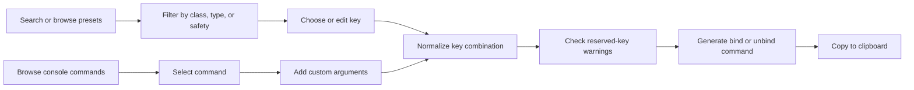
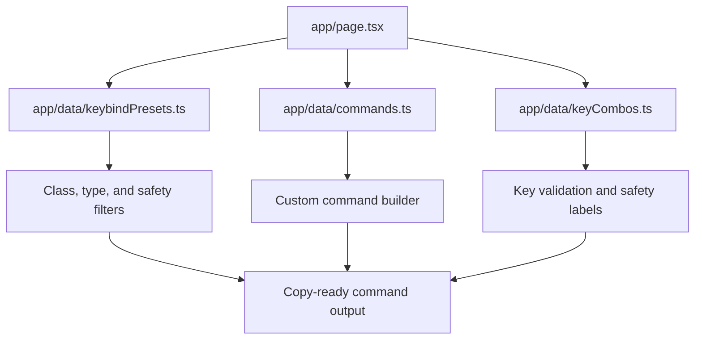

<div align="center">


# BindForge NW

### Neverwinter keybind builder, console-command browser, safety checker, and copy-ready bind/unbind generator.

<p>
  
  
  
  
  
</p>

[Overview](#overview) · [Features](#features) · [How it works](#how-it-works) · [SEO](#seo-and-discoverability) · [Setup](#getting-started) · [Data](#data-sources-and-maintenance) · [Roadmap](#roadmap)

</div>

---

> [!NOTE]
> BindForge NW is a working Neverwinter utility. The codebase includes searchable presets, class/type/safety filters, custom key combinations, bind and unbind generation, risky-key warnings, console-command browsing, and clipboard-ready output.

## Overview

**BindForge NW** helps Neverwinter players create keybinds without memorizing the game’s console-command syntax.

A player can:

1. Search for a known action or preset.
2. Filter by class, command type, or safety level.
3. Choose or edit the key combination.
4. Review warnings for risky or reserved keys.
5. Copy a ready-to-paste `/bind` or `/unbind` command.

The project is designed for players who know what they want to automate but do not want to search scattered wiki pages, old forum posts, spreadsheets, or Discord messages every time they need the correct command.

## Features

<table>
  <tr>
    <td width="50%" valign="top">
      <h3>Preset keybind library</h3>
      <p>Browse practical keybinds for invocation, targeting, VIP services, Bard songs, combat, companions, animation cancel, utility, and more.</p>
    </td>
    <td width="50%" valign="top">
      <h3>Custom command builder</h3>
      <p>Choose any supported console command, add arguments, select a key combination, and generate a complete bind or unbind line.</p>
    </td>
  </tr>
  <tr>
    <td width="50%" valign="top">
      <h3>Safety warnings</h3>
      <p>Flags movement keys, menu keys, chat keys, mouse buttons, Escape, and dangerous Windows shortcuts before players overwrite something important.</p>
    </td>
    <td width="50%" valign="top">
      <h3>Search and filtering</h3>
      <p>Filter presets by class, category, and difficulty, then search commands and key combinations independently.</p>
    </td>
  </tr>
</table>

### Current keybind categories

- Invocation and character
- Targeting
- VIP services
- Bard songs
- Animation cancel
- Combat
- Companion
- Inventory and buffs
- Loot and interact
- Utility
- Camera and screenshot
- Social
- Risky and testing

### Safety levels

| Level | Meaning |
|---|---|
| Easy | Intended for straightforward, commonly useful binds |
| Advanced | Requires more care or game knowledge |
| Risky | Should be tested carefully before regular use |

The interface also classifies key combinations as:

- Safe
- Test first
- Risky

## How it works



### Command generation

Bind mode produces:

```text
/bind <key> <command> <optional arguments>
```

Unbind mode produces:

```text
/unbind <key>
```

The application normalizes modifier order so custom combinations remain consistent:

```text
ctrl → alt → shift → key
```

### Key warnings

The current warning system checks for common conflicts such as:

- movement and jumping keys
- targeting keys
- menu and inventory shortcuts
- interaction and loot keys
- chat and reply keys
- number keys used by powers or items
- mouse buttons used for attacks or camera control
- Escape
- Windows shortcuts such as `Alt+F4`, `Alt+Tab`, and `Ctrl+Alt+Delete`

## Architecture



### Main files

| Path | Purpose |
|---|---|
| `app/page.tsx` | Main interface, filters, state, normalization, warnings, and copy behavior |
| `app/data/commands.ts` | Neverwinter console-command catalog |
| `app/data/keyCombos.ts` | Supported key combinations and safety metadata |
| `app/data/keybindPresets.ts` | Ready-made binds grouped by class and purpose |
| `app/layout.tsx` | Metadata, structured data, icons, and application shell |
| `app/opengraph-image.tsx` | Dynamic 1200×630 social preview |
| `public/robots.txt` | Search crawler policy |
| `public/llms.txt` | Machine-readable project summary |

## Technology stack

| Layer | Technology | Purpose |
|---|---|---|
| Framework | Next.js `16.2.6` | App Router, metadata, rendering, and production build |
| UI | React `19.2.6` | Interactive filters and command-builder state |
| Language | TypeScript `5.9.3` | Typed presets, commands, combos, and validation |
| Styling | Tailwind CSS `4.2.1` | Responsive layout and component styling |
| Linting | ESLint `9.39.4` | Code-quality checks |

## SEO and discoverability

BindForge now includes application-level SEO for relevant searches such as:

- Neverwinter keybind builder
- Neverwinter bind commands
- Neverwinter console commands
- Neverwinter unbind command
- Neverwinter Bard song binds
- Neverwinter targeting bind
- Neverwinter animation cancel bind
- Neverwinter command generator

### Implemented SEO features

- descriptive title template
- search-focused meta description
- crawl directives
- Open Graph metadata
- Twitter/X summary card
- dynamic 1200×630 social image
- SoftwareApplication JSON-LD
- author and repository information
- `robots.txt`
- `llms.txt`
- semantic headings and explanatory body content

A canonical production URL and sitemap should be added after the final public domain is confirmed.

## Getting started

### Requirements

- Node.js `22.13+`
- npm or a compatible Node package manager

### Install and run

```bash
git clone https://github.com/Nischhalsubba/BindForge-NW.git
cd BindForge-NW
npm install
npm run dev
```

Open:

```text
http://localhost:3000
```

### Build

```bash
npm run build
npm run start
```

### Lint

```bash
npm run lint
```

## Data sources and maintenance

The key-combination catalog is derived from a local Neverwinter reference file, while console commands are based on community command documentation and wiki material.

Before publishing updates:

- verify that commands still work in the current game version
- mark undocumented or uncertain commands clearly
- avoid presenting risky commands as safe
- preserve aliases and required parameters
- check whether key combinations conflict with default game controls
- record the source and date for newly added commands

## Testing checklist

### Functional QA

- [ ] Search returns expected presets.
- [ ] Class filters only show relevant binds.
- [ ] Type filters match the intended categories.
- [ ] Safety filters produce correct results.
- [ ] Custom key combinations normalize correctly.
- [ ] Bind mode generates `/bind` output.
- [ ] Unbind mode generates `/unbind` output.
- [ ] Custom arguments appear only when supplied.
- [ ] Clipboard feedback appears after copying.
- [ ] Reserved and risky keys show the correct warning.

### SEO QA

- [ ] Page title is unique and descriptive.
- [ ] Meta description matches the visible product.
- [ ] Open Graph image renders in production.
- [ ] Structured data validates.
- [ ] `robots.txt` is publicly reachable.
- [ ] `llms.txt` is publicly reachable.
- [ ] Canonical URL is added after deployment.
- [ ] Sitemap is added after deployment.

## Known limitations

- Command validity can change after game updates.
- Some console commands may be undocumented or inconsistently supported.
- The project does not automatically apply keybinds inside Neverwinter.
- Users must paste generated lines into the appropriate game context themselves.
- The current repository does not expose a confirmed production domain.
- Risk labels reduce mistakes but cannot guarantee a command is harmless.

## Roadmap

- [ ] Add a confirmed public deployment.
- [ ] Add canonical metadata and sitemap.
- [ ] Expand verified class-specific presets.
- [ ] Add source and verification dates to commands.
- [ ] Add import/export for personal bind collections.
- [ ] Add shareable preset URLs.
- [ ] Add automated tests for normalization and output generation.
- [ ] Add stronger keyboard and screen-reader coverage.
- [ ] Add version notes for commands affected by game patches.

## Maintainer

**Nischhal Raj Subba**

Product design, frontend implementation, data organization, and repository direction.

## Disclaimer

BindForge NW is an independent community project. It is not affiliated with or endorsed by Cryptic Studios, Arc Games, Gearbox Publishing, or the Neverwinter rights holders. Game names, commands, and related assets belong to their respective owners.
