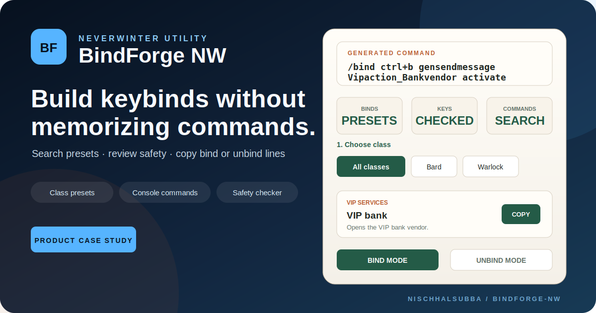

<div align="center">



# BindForge NW

### Build Neverwinter keybinds without memorizing console commands

A data-driven keybind preset browser, console-command explorer, safety checker, and copy-ready `/bind` or `/unbind` generator.


[Engineering case study](./docs/PRODUCT_AND_ENGINEERING_CASE_STUDY.md) · [Architecture](./docs/architecture.md) · [Release checklist](./docs/release-checklist.md)

</div>

## Product

BindForge NW helps Neverwinter players find, edit, generate, and copy practical keybind commands without searching scattered forum posts, wiki fragments, spreadsheets, or old chat messages.

Players can search and filter presets, edit key combinations, review conflict warnings, switch between bind and unbind output, build custom commands, create custom chat binds, and preserve settings in the browser.

## Main capabilities

| Capability | Description |
|---|---|
| Preset library | Ready-made binds for combat, utility, class, companion, VIP, camera, social, and other actions |
| Search and filtering | Search presets and filter by class, action type, and difficulty |
| Bind and unbind modes | Generate `/bind` or `/unbind` output from the same shared state |
| Command Lab | Combine supported keys with catalog commands and optional arguments |
| Custom chat builder | Generate safe, normalized `say` message binds |
| Conflict guidance | Warn about movement, menus, chat, mouse buttons, and reserved Windows combinations |
| Local persistence | Save filters, keys, appearance, Command Lab, and custom-chat settings in the browser |
| Backup tools | Export, validate, import, migrate, and clear versioned JSON settings |
| Recovery UI | Route-level loading, not-found, and runtime-error experiences |
| Responsive UI | Mobile-first toolbar and filter behavior with tablet and desktop enhancement |

## Command output

Bind mode:

```text
/bind <key> <command> <optional arguments>
```

Unbind mode:

```text
/unbind <key>
```

Example:

```text
/bind ctrl+b gensendmessage Vipaction_Bankvendor activate
```

## Architecture

`BindForgeProvider` is the single source of truth for user-editable application state. Components consume state and actions through `useBindForge`; they do not synchronize through document queries, mutation observers, or synthetic input events.

Important areas:

```text
app/
├── BindForgeProvider.tsx       shared state, persistence, theme, backup and recovery
├── FilterTopBar.tsx            responsive search, action filter, mode and reset controls
├── components/
│   ├── FilterSidebar.tsx       class, difficulty, appearance and backup controls
│   ├── KeybindLibrary.tsx      preset filtering, grouping and editable cards
│   ├── CommandLab.tsx          custom command generation
│   └── CustomSayBuilder.tsx    custom chat bind generation
├── lib/                        deterministic command, backup, clipboard and catalog helpers
├── error.tsx                   runtime recovery
├── loading.tsx                 route loading state
├── not-found.tsx               missing-route recovery
└── mobile-first.css            responsive layout and contrast corrections

e2e/
└── bindforge.spec.ts           mobile, tablet and desktop browser regression coverage
```

See [docs/architecture.md](./docs/architecture.md) for the detailed state and component boundaries.

## Run locally

Requirements:

- Node.js 22.13 or newer
- npm with the committed lockfile

```bash
npm ci
npm run dev
```

Open `http://localhost:3000`.

## Verification

Install the browser-test tooling once when working locally:

```bash
npm install --no-save @playwright/test@1.55.0 axe-core@4.10.2
npx playwright install chromium
```

Then run:

```bash
npm run check:release
```

The release check covers:

- ESLint
- TypeScript validation
- unit and catalog tests
- production build
- Playwright smoke and regression tests
- mobile, tablet, and desktop viewport coverage
- persistence and clear-data regression checks
- route recovery
- keyboard navigation
- axe accessibility checks in dark and light appearance

GitHub Actions retains typecheck, build, and Playwright diagnostics for failed runs.

## Current status

| Area | Status |
|---|---|
| Preset search and filtering | Implemented |
| Command and key-combination browsers | Implemented |
| Bind, unbind and custom-chat generation | Implemented |
| Shared provider architecture | Implemented |
| Browser-local persistence and backups | Implemented |
| Route recovery | Implemented |
| Unit and catalog tests | Implemented |
| Playwright regression suite | Under release stabilization in PR #31 |
| Accessibility baseline | Under release stabilization in PR #31 |
| Mobile-first responsive layout | Under release stabilization in PR #31 |
| Verified public production deployment | Pending |
| Real production screenshots | Pending deployment verification |

## Release process

A build is not ready for promotion until:

1. The pull-request Quality workflow passes.
2. The manually triggered Release verification workflow passes.
3. Desktop, tablet, and mobile layouts are reviewed.
4. Search, filters, output modes, persistence, backup, theme, clipboard, and recovery behavior are manually checked.
5. The production deployment URL is opened and smoke-tested.
6. The release record includes the commit, workflows, deployment, tester, browsers, viewports, date, and accepted limitations.

See [docs/release-checklist.md](./docs/release-checklist.md).

## Production deployment

A verified production URL is not yet documented. After deployment:

- run the production smoke checklist
- verify metadata, Open Graph image, `robots.txt`, and `llms.txt`
- add the canonical URL and sitemap
- record the deployment URL and commit
- capture real desktop and mobile screenshots

## Data maintenance

Before publishing command updates:

- verify behavior against the current game version
- record the source and verification date
- preserve aliases and required arguments
- clearly mark uncertain or undocumented behavior
- review default-key conflicts
- never describe advisory safety guidance as a guarantee

## Known limitations

- Neverwinter commands may change after patches.
- Some commands are undocumented or inconsistently supported.
- BindForge generates text but does not apply binds inside the game.
- Players must paste generated commands themselves.
- Conflict and safety guidance is advisory.
- A verified public production deployment is still pending.

## Roadmap

1. Finish PR #31 browser, accessibility, and responsive verification.
2. Run and record the manual Release verification workflow.
3. Publish and verify the production deployment.
4. Add the canonical URL and sitemap.
5. Capture real desktop and mobile production screenshots.
6. Record source and verification dates throughout the command catalog.
7. Add shareable preset URLs and personal bind collections.

## Disclaimer

BindForge NW is an independent community project. It is not affiliated with or endorsed by Cryptic Studios, Arc Games, Gearbox Publishing, or the Neverwinter rights holders. Game names, commands, and related assets belong to their respective owners.

## Author

Designed and developed by [Nischhal Raj Subba](https://github.com/Nischhalsubba).
