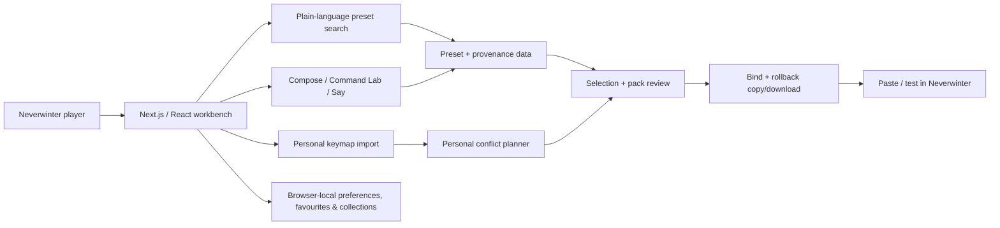
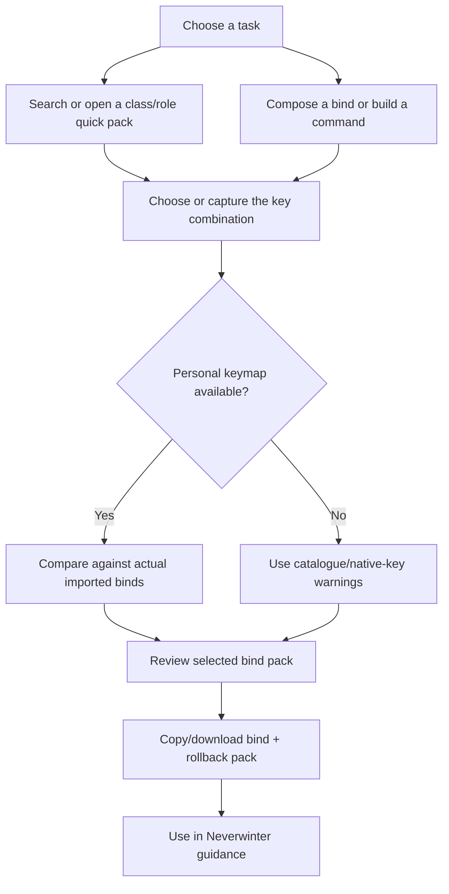
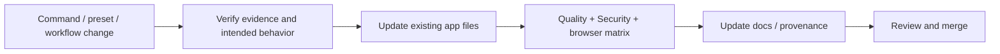

<div align="center">

# BindForge NW

**Find it. Build it. Bind it.**

Build, review, organize, and export Neverwinter keybinds without memorizing console commands.


[Open web app](https://neverwinterkeybind.netlify.app) · [Browse app](./web) · [Technical README](./web/README.md) · [Issues](https://github.com/Nischhalsubba/BindForge-NW/issues)

</div>

## Overview

**BindForge NW** is a local-first Neverwinter keybind workbench. It combines plain-language preset search, visual key-combination capture, a verified composer, Command Lab, personal-keymap conflict detection, collections, class/role quick packs, trust/provenance information, and copy/download-ready `/bind` / `/unbind` output.

| Audience | Use BindForge NW for |
|---|---|
| Players | Find binds, capture keyboard/mouse combinations, review conflicts and export a final pack |
| New players | Follow guided first-visit paths, plain-language help and post-copy in-game instructions |
| Power users | Use Command Lab, raw commands, provenance, portable links, bulk packs and rollback output |
| Maintainers | Review evidence, verification dates, command coverage, accessibility and release quality |

## Current product capabilities

- **Plain-language Search v2** with aliases, common player wording, typo tolerance, relevance ranking and no-result recovery.
- **Visual key combination builder** for keyboard modifiers, keyboard keys, left/right/middle mouse input and `+`-separated combinations. Normal `+` and numpad `+` are separators rather than standalone bind keys.
- **Four workflows**: Search, Compose, Command Lab and Say, with Simple / Standard / Advanced experience levels.
- **Personal keymap import** from pasted bind text or `.txt` files, analyzed locally for real key conflicts.
- **Pack review** with selected-bind conflicts, final bind output, rollback/unbind output, copy and download actions.
- **Catalogue-backed class/role quick packs** that preserve each preset's existing verification level rather than inventing build advice.
- **Trust labels** for Verified, Community tested and Experimental data, with source/evidence context where available.
- **Use in Neverwinter guidance** after copying a real bind, including test/recovery and rollback guidance.
- **Favourites, collections, portable sharing and browser-local backup/restore**.
- **Accessibility preferences** for theme, text size, density, contrast, larger controls and reduced motion.
- **Responsive release gates** across mobile, tablet and desktop, plus keyboard/focus/overflow/accessibility checks.

<details open>
<summary><strong>🏗️ Product architecture</strong></summary>


```mermaid
flowchart LR
    PLAYER["Neverwinter player"] --> UI["Next.js / React workbench"]
    UI --> SEARCH["Plain-language preset search"]
    UI --> BUILD["Compose / Command Lab / Say"]
    UI --> KEYMAP["Personal keymap import"]
    SEARCH --> CATALOG["Preset + provenance data"]
    BUILD --> CATALOG
    KEYMAP --> CONFLICTS["Personal conflict planner"]
    CATALOG --> REVIEW["Selection + pack review"]
    CONFLICTS --> REVIEW
    REVIEW --> EXPORT["Bind + rollback copy/download"]
    UI --> LOCAL["Browser-local preferences, favourites & collections"]
    EXPORT --> GAME["Paste / test in Neverwinter"]
```

</details>

## Player flow


```mermaid
flowchart TD
    START["Choose a task"] --> FIND["Search or open a class/role quick pack"]
    START --> BUILD["Compose a bind or build a command"]
    FIND --> KEY["Choose or capture the key combination"]
    BUILD --> KEY
    KEY --> IMPORT{"Personal keymap available?"}
    IMPORT -->|Yes| CHECK["Compare against actual imported binds"]
    IMPORT -->|No| CHECK2["Use catalogue/native-key warnings"]
    CHECK --> REVIEW["Review selected bind pack"]
    CHECK2 --> REVIEW
    REVIEW --> EXPORT["Copy/download bind + rollback pack"]
    EXPORT --> GUIDE["Use in Neverwinter guidance"]
```

## Repository map

- [`web/`](./web) — maintained web application and detailed documentation.
- [`bootstrap/`](./bootstrap) — repository bootstrap/support material.
- [`netlify.toml`](./netlify.toml) — Netlify production integration.
- [`wrangler.jsonc`](./wrangler.jsonc) — additional Cloudflare/OpenNext configuration.
- [`.github/`](./.github) — Quality and Security automation.

## Getting started

```bash
git clone https://github.com/Nischhalsubba/BindForge-NW.git
cd BindForge-NW/web
npm ci
npm run dev
```

See [`web/README.md`](./web/README.md) for architecture, verification commands, limitations and release notes.

## Design and data principles

Dense command tooling should stay scannable and reversible. Preserve clear key/command relationships, explicit conflict states, visible trust/evidence, keyboard accessibility, useful empty/error states, responsive layouts and copy/export feedback. Never promote a command from experimental/community evidence to verified without evidence, and never describe advisory conflict guidance as a guarantee about a player's in-game configuration.

## Contribution flow


```mermaid
flowchart LR
    DATA["Command / preset / workflow change"] --> VERIFY["Verify evidence and intended behavior"]
    VERIFY --> IMPLEMENT["Update existing app files"]
    IMPLEMENT --> TEST["Quality + Security + browser matrix"]
    TEST --> DOCS["Update docs / provenance"]
    DOCS --> PR["Review and merge"]
```
