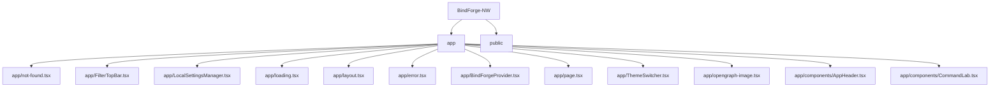
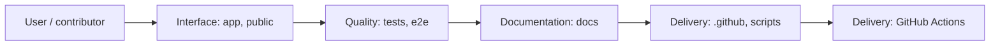
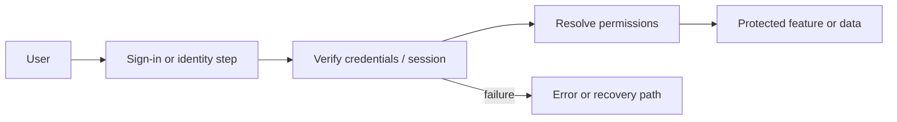
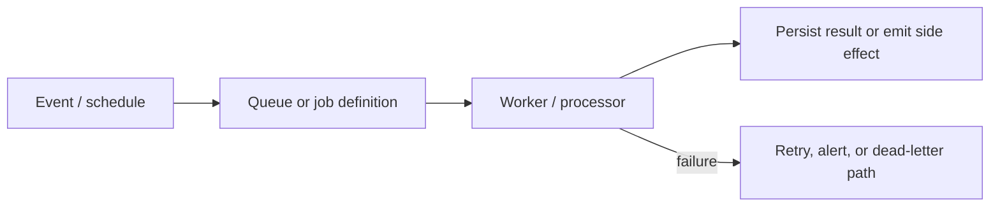
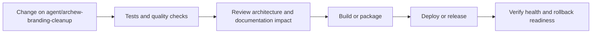
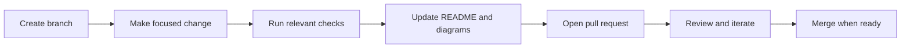

<!-- interactive-readme-standard:start -->

<div align="center">

# BindForge-NW

**Branch-aware technical guide for [`agent/archew-branding-cleanup`](https://github.com/Nischhalsubba/BindForge-NW/tree/agent/archew-branding-cleanup)**

<p>       </p>

<p>
  <a href="https://github.com/Nischhalsubba/BindForge-NW/tree/agent/archew-branding-cleanup"><strong>Browse source</strong></a> ·
  <a href="https://github.com/Nischhalsubba/BindForge-NW/issues"><strong>Issues</strong></a> ·
  <a href="https://github.com/Nischhalsubba/BindForge-NW/codespaces/new?ref=agent%2Farchew-branding-cleanup"><strong>Open in Codespaces</strong></a>
</p>

</div>

> [!IMPORTANT]
> This guide is generated from the files actually present on `agent/archew-branding-cleanup`. It links to detected source paths, preserves project-authored notes, and avoids claiming components that were not found.

## At a glance

| Item | Detected value |
|---|---|
| Purpose | A Neverwinter keybind builder, console-command browser, conflict planner, collection manager, and copy-ready bind-pack generator. |
| Branch role | Compared with `main` |
| Stack | Next.js, React, Tailwind CSS, TypeScript, CSS, JavaScript |
| Manifests | package.json |
| Prerequisites | Node.js |
| Delivery | GitHub Actions |
| License | No license file detected |

## Branch scope

This branch differs from the default branch in the following detected paths:

- [`README.md`](https://github.com/Nischhalsubba/BindForge-NW/blob/agent/archew-branding-cleanup/README.md)

## Quick start

```bash
npm install
npm run dev
npm run start
npm run build
npm run test
```

### Configuration surface

- No committed environment example file was detected.

> Never commit secrets, private keys, production credentials, customer data, or unredacted infrastructure details.

## Repository map


```mermaid
flowchart TD
    ROOT["BindForge-NW / agent/archew-branding-cleanup"]
    ROOT --> P0[".github/"]
    ROOT --> P1["app/"]
    ROOT --> P2["docs/"]
    ROOT --> P3["e2e/"]
    ROOT --> P4["public/"]
    ROOT --> P5["scripts/"]
    ROOT --> P6["tests/"]
    ROOT --> P7[".gitignore"]
    ROOT --> P8["AGENTS.md"]
    ROOT --> P9["eslint.config.mjs"]
    ROOT --> P10["next.config.ts"]
    ROOT --> P11["open-next.config.ts"]
    ROOT --> P12["package-lock.json"]
    ROOT --> P13["package.json"]
    ROOT --> P14["playwright.config.ts"]
    ROOT --> P15["playwright.production.config.ts"]
    ROOT --> P16["postcss.config.mjs"]
    ROOT --> P17["tsconfig.json"]
    ROOT --> MORE["+ 2 more top-level entries"]
```

| Responsibility | Detected source paths |
|---|---|
| Interface | [`app`](https://github.com/Nischhalsubba/BindForge-NW/tree/agent/archew-branding-cleanup/app), [`public`](https://github.com/Nischhalsubba/BindForge-NW/tree/agent/archew-branding-cleanup/public) |
| Quality | [`tests`](https://github.com/Nischhalsubba/BindForge-NW/tree/agent/archew-branding-cleanup/tests), [`e2e`](https://github.com/Nischhalsubba/BindForge-NW/tree/agent/archew-branding-cleanup/e2e) |
| Documentation | [`docs`](https://github.com/Nischhalsubba/BindForge-NW/tree/agent/archew-branding-cleanup/docs) |
| Delivery | [`.github`](https://github.com/Nischhalsubba/BindForge-NW/tree/agent/archew-branding-cleanup/.github), [`scripts`](https://github.com/Nischhalsubba/BindForge-NW/tree/agent/archew-branding-cleanup/scripts) |

## Website or application map


```mermaid
flowchart TD
    APP["BindForge-NW"]
    APP --> R0["app"]
    APP --> R1["public"]
    R0 --> F0["app/not-found.tsx"]
    R0 --> F1["app/FilterTopBar.tsx"]
    R0 --> F2["app/LocalSettingsManager.tsx"]
    R0 --> F3["app/loading.tsx"]
    R0 --> F4["app/layout.tsx"]
    R0 --> F5["app/error.tsx"]
    R0 --> F6["app/BindForgeProvider.tsx"]
    R0 --> F7["app/page.tsx"]
    R0 --> F8["app/ThemeSwitcher.tsx"]
    R0 --> F9["app/opengraph-image.tsx"]
    R0 --> F10["app/components/AppHeader.tsx"]
    R0 --> F11["app/components/CommandLab.tsx"]
```

## Architecture and responsibility flow


```mermaid
flowchart LR
    USER["User / contributor"]
    USER --> A0["Interface: app, public"]
    A0 --> A1["Quality: tests, e2e"]
    A1 --> A2["Documentation: docs"]
    A2 --> A3["Delivery: .github, scripts"]
    A3 --> DELIVERY["Delivery: GitHub Actions"]
```

<details>
<summary><strong>Authentication and authorization flow</strong></summary>


```mermaid
flowchart LR
    USER["User"] --> SIGNIN["Sign-in or identity step"]
    SIGNIN --> VERIFY["Verify credentials / session"]
    VERIFY --> AUTHORIZE["Resolve permissions"]
    AUTHORIZE --> PROTECTED["Protected feature or data"]
    VERIFY -->|failure| RECOVER["Error or recovery path"]
```

Relevant detected files: [`app/data/catalogIntegrity.ts`](https://github.com/Nischhalsubba/BindForge-NW/blob/agent/archew-branding-cleanup/app/data/catalogIntegrity.ts).

> The diagram expresses the responsibility sequence only. Confirm exact providers, token formats, roles, and recovery behavior in the linked source.

</details>
<details>
<summary><strong>Background jobs and scheduled work</strong></summary>


```mermaid
flowchart LR
    EVENT["Event / schedule"] --> QUEUE["Queue or job definition"]
    QUEUE --> WORKER["Worker / processor"]
    WORKER --> RESULT["Persist result or emit side effect"]
    WORKER -->|failure| RETRY["Retry, alert, or dead-letter path"]
```

Relevant detected files: [`app/components/ServiceWorkerRegistration.tsx`](https://github.com/Nischhalsubba/BindForge-NW/blob/agent/archew-branding-cleanup/app/components/ServiceWorkerRegistration.tsx).

</details>

## Quality, security, and operations

<table>
<tr>
<td width="33%" valign="top">

### Quality

- [`tests`](https://github.com/Nischhalsubba/BindForge-NW/tree/agent/archew-branding-cleanup/tests)
- [`e2e`](https://github.com/Nischhalsubba/BindForge-NW/tree/agent/archew-branding-cleanup/e2e)

Detected commands:
- `npm run dev`
- `npm run start`
- `npm run build`
- `npm run test`
- `npm run lint`
- `npm run typecheck`
- `npm run preview`

</td>
<td width="33%" valign="top">

### Security

- No dedicated security policy or automated dependency configuration was detected.

Review authentication, authorization, input validation, dependency updates, secret handling, and failure recovery before release.

</td>
<td width="34%" valign="top">

### Observability

- No dedicated observability integration was detected automatically.

Define useful logs, metrics, traces, alerts, and rollback signals for production-facing branches.

</td>
</tr>
</table>

## Delivery flow


```mermaid
flowchart LR
    CHANGE["Change on agent/archew-branding-cleanup"] --> CHECK["Tests and quality checks"]
    CHECK --> REVIEW["Review architecture and documentation impact"]
    REVIEW --> BUILD["Build or package"]
    BUILD --> DEPLOY["Deploy or release"]
    DEPLOY --> VERIFY["Verify health and rollback readiness"]
```

### Automation detected

- [`.github/workflows/production-smoke.yml`](https://github.com/Nischhalsubba/BindForge-NW/blob/agent/archew-branding-cleanup/.github/workflows/production-smoke.yml)
- [`.github/workflows/quality.yml`](https://github.com/Nischhalsubba/BindForge-NW/blob/agent/archew-branding-cleanup/.github/workflows/quality.yml)
- [`.github/workflows/release.yml`](https://github.com/Nischhalsubba/BindForge-NW/blob/agent/archew-branding-cleanup/.github/workflows/release.yml)

## Contribution flow


```mermaid
flowchart LR
    FORK["Create branch"] --> CHANGE["Make focused change"]
    CHANGE --> TEST["Run relevant checks"]
    TEST --> DOCS["Update README and diagrams"]
    DOCS --> PR["Open pull request"]
    PR --> REVIEW["Review and iterate"]
    REVIEW --> MERGE["Merge when ready"]
```

- Keep changes focused and explain architectural consequences.
- Run the checks relevant to the changed area.
- Update diagrams whenever routes, modules, data models, authentication, jobs, or delivery paths change.
- Add screenshots or recordings for visual behavior changes when useful.
- Use issues for reproducible defects and pull requests for reviewable changes.

## Ownership and support

| Topic | Source |
|---|---|
| Repository | [`Nischhalsubba/BindForge-NW`](https://github.com/Nischhalsubba/BindForge-NW) |
| Branch | [`agent/archew-branding-cleanup`](https://github.com/Nischhalsubba/BindForge-NW/tree/agent/archew-branding-cleanup) |
| Ownership | No CODEOWNERS file detected |
| Contributing | Use the contribution flow above |
| Support | [Open or review issues](https://github.com/Nischhalsubba/BindForge-NW/issues) |
| License | No license file detected |

<details>
<summary><strong>Documentation maintenance checklist</strong></summary>

- [ ] Purpose and branch scope are accurate.
- [ ] Setup and configuration commands still work.
- [ ] Repository, application, API, data, authentication, job, and deployment diagrams match the code.
- [ ] Tests, security controls, observability, and rollback behavior are documented.
- [ ] Links point to real files on this branch.
- [ ] No secrets or private operational details are exposed.

</details>

<!-- interactive-readme-standard:end -->

<!-- project-authored-notes:start -->
<details>
<summary><strong>Project-authored notes preserved from this branch</strong></summary>

<div align="center">


# BindForge NW

### Build, review, organize, and export Neverwinter keybinds without memorizing console commands

A data-driven preset browser, conflict planner, command explorer, collection manager, and copy-ready `/bind` or `/unbind` generator.


[Live application](https://neverwinterkeybind.netlify.app) · [Engineering case study](./docs/PRODUCT_AND_ENGINEERING_CASE_STUDY.md) · [Architecture](./docs/architecture.md) · [Release status](./docs/RELEASE_STATUS.md)

</div>

## Product

BindForge NW helps Neverwinter players find, edit, validate, organize, share, and export practical keybind commands without searching scattered forum posts, wiki fragments, spreadsheets, or old chat messages.

## Main capabilities

| Capability | Description |
|---|---|
| Preset library | Searchable binds for combat, utility, class, companion, VIP, camera, social, and other actions |
| Conflict planner | Duplicate detection, common native-key warnings, intentional-override guidance, and next-safer-key replacement |
| Bulk bind packs | Select visible presets, copy bind/unbind packs, and download text files |
| Favourites and collections | Save favourites and named local collections in the browser |
| Shareable views | Copy URLs for a selected preset, collection, and active filters |
| Provenance | Source type, confidence, verification date, game-version notes, and provenance filtering |
| Advanced browsing | Card or compact view, sorting, collapsible groups, collection filtering, safety filtering, and search highlighting |
| Bind and unbind modes | Generate `/bind` or `/unbind` output from the same shared state |
| Command Lab | Combine supported keys with catalog commands and optional arguments |
| Custom chat builder | Generate safe, normalized `say` message binds |
| Local persistence | Save filters, keys, appearance, Command Lab, custom chat, favourites, collections, and library preferences |
| Backup tools | Export, validate, import, migrate, and clear versioned JSON settings |
| Responsive UI | Mobile, tablet, and desktop layouts with keyboard and reduced-motion support |
| Copy feedback | Local copied states, global toast feedback, fallback handling, errors, and accessible announcements |

## Command output

```text
/bind <key> <command> <optional arguments>
/unbind <key>
```

Example:

```text
/bind ctrl+b gensendmessage Vipaction_Bankvendor activate
```

## Run locally

Requirements:

- Node.js 22.13 or newer
- npm with the committed lockfile

```bash
npm ci
npm run dev
```

Open `http://localhost:3000`.

## Verification

Install browser-test tooling once when working locally:

```bash
npm install --no-save @playwright/test@1.55.0 axe-core@4.10.2
npx playwright install chromium
```

Run the complete local release gate:

```bash
npm run check:release
```

The release gate covers ESLint, TypeScript, unit and catalog tests, production build, mobile/tablet/desktop Playwright checks, persistence, recovery, keyboard navigation, and dark/light axe accessibility checks.

The dedicated `Production smoke` workflow verifies the live Netlify domain, primary search/filter journey, canonical and Open Graph URLs, `robots.txt`, sitemap, skip navigation, and theme controls.

## Production

- Canonical URL: `https://neverwinterkeybind.netlify.app`
- Netlify deploys `main` automatically.
- Cloudflare Workers provides an additional production-compatible deployment path.
- Current release evidence and accepted limitations are recorded in [docs/RELEASE_STATUS.md](./docs/RELEASE_STATUS.md).

## Stylesheet architecture

Application code imports one authoritative stylesheet entrypoint: `app/app.css`. It controls the order of legacy visual layers and the final product layer in one location, avoiding scattered imports in React code. Historical layers remain isolated so regressions can be traced and removed safely over time without silently changing the approved design.

## Data maintenance

Before publishing command updates:

- verify behavior against the current Neverwinter version
- record a source URL when available
- record a verification date
- preserve aliases and required arguments
- clearly mark uncertain or undocumented behavior
- review default-key conflicts
- never describe advisory safety guidance as a guarantee

## Branch protection

Required checks and merge protections are documented in [docs/BRANCH_PROTECTION.md](./docs/BRANCH_PROTECTION.md). Pull requests should not merge until Quality, Production smoke, and deployment previews are green.

## Known limitations

- Neverwinter commands can change after patches.
- Some commands are undocumented or inconsistently supported.
- BindForge generates text but cannot apply binds inside the game.
- Players must paste generated commands themselves.
- Conflict guidance is advisory because personal in-game remaps are not readable by a browser.
- Favourites and collections are browser-local unless exported or shared.

## Disclaimer

BindForge NW is an independent community project. It is not affiliated with or endorsed by Cryptic Studios, Arc Games, Gearbox Publishing, or the Neverwinter rights holders. Game names, commands, and related assets belong to their respective owners.

## Author

Designed and developed by [Nischhal Raj Subba](https://github.com/Nischhalsubba).

</details>
<!-- project-authored-notes:end -->
