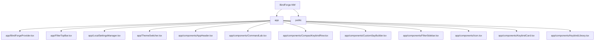
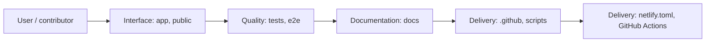
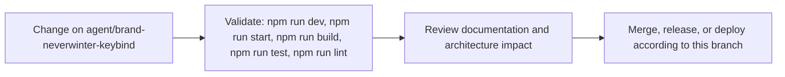

<div align="center">


# BindForge NW

<!-- interactive-readme-standard:start -->

> [!NOTE]
> **Branch-specific documentation:** this section is maintained for [`agent/brand-neverwinter-keybind`](https://github.com/Nischhalsubba/BindForge-NW/tree/agent/brand-neverwinter-keybind). It is generated from the files present on this branch and preserves the project-authored README below.

<details open>
<summary><strong>Interactive repository guide</strong></summary>

## Branch overview

| Item | Value |
|---|---|
| Repository | [`Nischhalsubba/BindForge-NW`](https://github.com/Nischhalsubba/BindForge-NW) |
| Branch | [`agent/brand-neverwinter-keybind`](https://github.com/Nischhalsubba/BindForge-NW/tree/agent/brand-neverwinter-keybind) |
| Detected stack | Next.js, React, Tailwind CSS, TypeScript, CSS, JavaScript |
| Detected manifests | package.json |
| Documentation policy | Every maintained branch must explain purpose, setup, structure, architecture, flows, testing, delivery, security, and ownership. |

## Repository structure


```mermaid
flowchart TD
    ROOT["BindForge-NW / agent/brand-neverwinter-keybind"]
    ROOT --> P0[".github/"]
    ROOT --> P1["app/"]
    ROOT --> P2["docs/"]
    ROOT --> P3["e2e/"]
    ROOT --> P4["public/"]
    ROOT --> P5["scripts/"]
    ROOT --> P6["tests/"]
    ROOT --> P7[".gitignore"]
    ROOT --> P8["AGENTS.md"]
    ROOT --> P9["CHANGELOG.md"]
    ROOT --> P10["CONTRIBUTING.md"]
    ROOT --> P11["eslint.config.mjs"]
    ROOT --> P12["netlify.toml"]
    ROOT --> P13["next.config.ts"]
    ROOT --> P14["open-next.config.ts"]
    ROOT --> P15["package-lock.json"]
    ROOT --> P16["package.json"]
    ROOT --> P17["playwright.config.ts"]
    ROOT --> MORE["+ 7 more top-level entries"]
```

The diagram is generated from the branch's actual top-level files and directories. Use the branch link above for complete source navigation.

## Website or application structure


```mermaid
flowchart TD
    APP["BindForge-NW"]
    APP --> R0["app"]
    APP --> R1["public"]
    R0 --> F0["app/BindForgeProvider.tsx"]
    R0 --> F1["app/FilterTopBar.tsx"]
    R0 --> F2["app/LocalSettingsManager.tsx"]
    R0 --> F3["app/ThemeSwitcher.tsx"]
    R0 --> F4["app/components/AppHeader.tsx"]
    R0 --> F5["app/components/CommandLab.tsx"]
    R0 --> F6["app/components/CompactKeybindRow.tsx"]
    R0 --> F7["app/components/CustomSayBuilder.tsx"]
    R0 --> F8["app/components/FilterSidebar.tsx"]
    R0 --> F9["app/components/Icon.tsx"]
    R0 --> F10["app/components/KeybindCard.tsx"]
    R0 --> F11["app/components/KeybindLibrary.tsx"]
```

## Application and responsibility flow


```mermaid
flowchart LR
    ACTOR["User / contributor"]
    ACTOR --> A0["Interface: app, public"]
    A0 --> A1["Quality: tests, e2e"]
    A1 --> A2["Documentation: docs"]
    A2 --> A3["Delivery: .github, scripts"]
    A3 --> DELIVERY["Delivery: netlify.toml, GitHub Actions"]
```

## Change-to-delivery flow


```mermaid
flowchart LR
    CHANGE["Change on agent/brand-neverwinter-keybind"]
    CHECK["Validate: npm run dev, npm run start, npm run build, npm run test, npm run lint"]
    REVIEW["Review documentation and architecture impact"]
    RELEASE["Merge, release, or deploy according to this branch"]
    CHANGE --> CHECK --> REVIEW --> RELEASE
```

## README requirements for this branch

- Explain what this branch contains and how it differs from the default branch.
- Keep installation, configuration, usage, testing, deployment, security, support, and license information accurate.
- Document repository, website or application, API, data, authentication, background-job, and deployment flows when they exist.
- Prefer Mermaid diagrams and expandable `<details>` sections for visual navigation.
- Link diagrams and modules to real source paths; never invent missing components.
- Preserve project-specific documentation and update diagrams whenever architecture or major paths change.
- Treat secrets, private infrastructure, customer data, and credentials as prohibited README content.

</details>

<!-- interactive-readme-standard:end -->

### Build, review, organize, and export Neverwinter keybinds without memorizing console commands

A data-driven preset browser, conflict planner, command explorer, collection manager, and copy-ready `/bind` or `/unbind` generator.


[Live application](https://neverwinterkeybind.netlify.app) · [Engineering case study](./docs/PRODUCT_AND_ENGINEERING_CASE_STUDY.md) · [Architecture](./docs/architecture.md) · [Release status](./docs/RELEASE_STATUS.md)

</div>

## Product

BindForge NW helps Neverwinter players find, edit, validate, organize, share, and export practical keybind commands without searching scattered forum posts, wiki fragments, spreadsheets, or old chat messages.

## Main capabilities

| Capability | Description |
|---|---|
| Preset library | Searchable binds for combat, utility, class, companion, VIP, camera, social, and other actions |
| Conflict planner | Duplicate detection, common native-key warnings, intentional-override guidance, and next-safer-key replacement |
| Bulk bind packs | Select visible presets, copy bind/unbind packs, and download text files |
| Favourites and collections | Save favourites and named local collections in the browser |
| Shareable views | Copy URLs for a selected preset, collection, and active filters |
| Provenance | Source type, confidence, verification date, game-version notes, and provenance filtering |
| Advanced browsing | Card or compact view, sorting, collapsible groups, progressive group rendering, collection filtering, safety filtering, and search highlighting |
| Bind and unbind modes | Generate `/bind` or `/unbind` output from the same shared state |
| Command Lab | Combine supported keys with catalog commands and optional arguments |
| Custom chat builder | Generate safe, normalized `say` message binds |
| Local persistence | Save filters, keys, appearance, Command Lab, custom chat, favourites, collections, and library preferences |
| Backup tools | Export, validate, import, migrate, and clear versioned JSON settings |
| Responsive UI | Mobile, tablet, and desktop layouts with keyboard, touch-target, and reduced-motion support |
| Copy feedback | Local copied states, global toast feedback, fallback handling, errors, and accessible announcements |

## Command output

```text
/bind <key> <command> <optional arguments>
/unbind <key>
```

Example:

```text
/bind ctrl+b gensendmessage Vipaction_Bankvendor activate
```

## Run locally

Requirements:

- Node.js 22.13 or newer
- npm with the committed lockfile

```bash
npm ci
npm run dev
```

Open `http://localhost:3000`.

## Verification

Install browser-test tooling once when working locally:

```bash
npm install --no-save @playwright/test@1.55.0 axe-core@4.10.2
npx playwright install chromium
```

Run the complete local release gate:

```bash
npm run check:release
```

The Quality gate covers ESLint, TypeScript, unit and catalog tests, production build, mobile/tablet/desktop Playwright checks, persistence, recovery, keyboard navigation, card and compact layouts, progressive rendering, retired-PWA protection, and dark/light axe accessibility checks.

The `Production smoke` workflow verifies a deploy preview for pull requests and the canonical Netlify domain after merge. It exercises the critical user journeys, captures desktop/tablet/mobile screenshots, fails on runtime errors and overflow, verifies accessibility and touch targets, and uploads the release evidence as an artifact.

The scheduled `Production monitor` workflow checks the live homepage, canonical and Open Graph metadata, social image, robots, sitemap, security headers, and retired service-worker endpoint every day. The same contract can be run manually:

```bash
node scripts/verify-production.mjs https://neverwinterkeybind.netlify.app
```

## Production

- Canonical URL: `https://neverwinterkeybind.netlify.app`
- Netlify deploys `main` automatically.
- Cloudflare Workers provides an additional production-compatible deployment path.
- Offline/PWA support is intentionally not part of the current release.
- Current evidence, rollback criteria, and accepted limitations are recorded in [docs/RELEASE_STATUS.md](./docs/RELEASE_STATUS.md) and [docs/phase-9-10-release-proof.md](./docs/phase-9-10-release-proof.md).

## Stylesheet architecture

Application code imports one authoritative stylesheet entrypoint: `app/app.css`, organized into tokens, base, theme, layout, components, and responsive layers. Component CSS modules remain limited to isolated interactive surfaces.

## Data maintenance

Before publishing command updates:

- verify behavior against the current Neverwinter version
- record a source URL when available
- record a verification date
- preserve aliases and required arguments
- clearly mark uncertain or undocumented behavior
- review default-key conflicts
- never describe advisory safety guidance as a guarantee

## Branch protection

Required checks and merge protections are documented in [docs/BRANCH_PROTECTION.md](./docs/BRANCH_PROTECTION.md). Pull requests should not merge until Quality, Production smoke, and deployment previews are green.

## Known limitations

- Neverwinter commands can change after patches.
- Some commands are undocumented or inconsistently supported.
- BindForge generates text but cannot apply binds inside the game.
- Players must paste generated commands themselves.
- Conflict guidance is advisory because personal in-game remaps are not readable by a browser.
- Favourites and collections are browser-local unless exported or shared.
- Offline installation is intentionally unsupported in the current release.

## Disclaimer

BindForge NW is an independent community project. It is not affiliated with or endorsed by Cryptic Studios, Arc Games, Gearbox Publishing, or the Neverwinter rights holders. Game names, commands, and related assets belong to their respective owners.

## Studio

Designed and developed by Archew.
