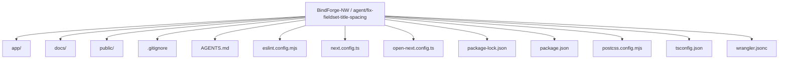
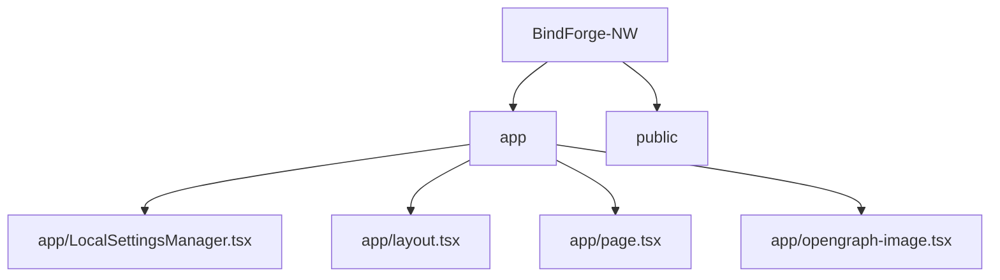
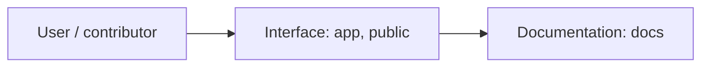
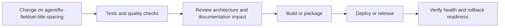
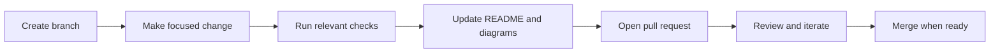

<!-- interactive-readme-standard:start -->

<div align="center">

# BindForge-NW

**Branch-aware technical guide for [`agent/fix-fieldset-title-spacing`](https://github.com/Nischhalsubba/BindForge-NW/tree/agent/fix-fieldset-title-spacing)**

<p>       </p>

<p>
  <a href="https://github.com/Nischhalsubba/BindForge-NW/tree/agent/fix-fieldset-title-spacing"><strong>Browse source</strong></a> ·
  <a href="https://github.com/Nischhalsubba/BindForge-NW/issues"><strong>Issues</strong></a> ·
  <a href="https://github.com/Nischhalsubba/BindForge-NW/codespaces/new?ref=agent%2Ffix-fieldset-title-spacing"><strong>Open in Codespaces</strong></a>
</p>

</div>

> [!IMPORTANT]
> This guide is generated from the files actually present on `agent/fix-fieldset-title-spacing`. It links to detected source paths, preserves project-authored notes, and avoids claiming components that were not found.

## At a glance

| Item | Detected value |
|---|---|
| Purpose | A Neverwinter keybind builder, console-command browser, safety checker, and copy-ready bind or unbind generator. |
| Branch role | Compared with `main` |
| Stack | Next.js, React, Tailwind CSS, TypeScript, CSS, JavaScript |
| Manifests | package.json |
| Prerequisites | Node.js |
| Delivery | No conventional deployment configuration detected |
| License | No license file detected |

## Branch scope

This branch differs from the default branch in the following detected paths:

- [`README.md`](https://github.com/Nischhalsubba/BindForge-NW/blob/agent/fix-fieldset-title-spacing/README.md)

## Quick start

```bash
npm install
npm run dev
npm run start
npm run build
npm run lint
```

### Configuration surface

- No committed environment example file was detected.

> Never commit secrets, private keys, production credentials, customer data, or unredacted infrastructure details.

## Repository map


```mermaid
flowchart TD
    ROOT["BindForge-NW / agent/fix-fieldset-title-spacing"]
    ROOT --> P0["app/"]
    ROOT --> P1["docs/"]
    ROOT --> P2["public/"]
    ROOT --> P3[".gitignore"]
    ROOT --> P4["AGENTS.md"]
    ROOT --> P5["eslint.config.mjs"]
    ROOT --> P6["next.config.ts"]
    ROOT --> P7["open-next.config.ts"]
    ROOT --> P8["package-lock.json"]
    ROOT --> P9["package.json"]
    ROOT --> P10["postcss.config.mjs"]
    ROOT --> P11["tsconfig.json"]
    ROOT --> P12["wrangler.jsonc"]
```

| Responsibility | Detected source paths |
|---|---|
| Interface | [`app`](https://github.com/Nischhalsubba/BindForge-NW/tree/agent/fix-fieldset-title-spacing/app), [`public`](https://github.com/Nischhalsubba/BindForge-NW/tree/agent/fix-fieldset-title-spacing/public) |
| Documentation | [`docs`](https://github.com/Nischhalsubba/BindForge-NW/tree/agent/fix-fieldset-title-spacing/docs) |

## Website or application map


```mermaid
flowchart TD
    APP["BindForge-NW"]
    APP --> R0["app"]
    APP --> R1["public"]
    R0 --> F0["app/LocalSettingsManager.tsx"]
    R0 --> F1["app/layout.tsx"]
    R0 --> F2["app/page.tsx"]
    R0 --> F3["app/opengraph-image.tsx"]
```

## Architecture and responsibility flow


```mermaid
flowchart LR
    USER["User / contributor"]
    USER --> A0["Interface: app, public"]
    A0 --> A1["Documentation: docs"]
```


## Quality, security, and operations

<table>
<tr>
<td width="33%" valign="top">

### Quality

- No conventional test directory was detected automatically.

Detected commands:
- `npm run dev`
- `npm run start`
- `npm run build`
- `npm run lint`
- `npm run typecheck`
- `npm run preview`

</td>
<td width="33%" valign="top">

### Security

- No dedicated security policy or automated dependency configuration was detected.

Review authentication, authorization, input validation, dependency updates, secret handling, and failure recovery before release.

</td>
<td width="34%" valign="top">

### Observability

- No dedicated observability integration was detected automatically.

Define useful logs, metrics, traces, alerts, and rollback signals for production-facing branches.

</td>
</tr>
</table>

## Delivery flow


```mermaid
flowchart LR
    CHANGE["Change on agent/fix-fieldset-title-spacing"] --> CHECK["Tests and quality checks"]
    CHECK --> REVIEW["Review architecture and documentation impact"]
    REVIEW --> BUILD["Build or package"]
    BUILD --> DEPLOY["Deploy or release"]
    DEPLOY --> VERIFY["Verify health and rollback readiness"]
```

### Automation detected

- No GitHub Actions workflow files were detected.

## Contribution flow


```mermaid
flowchart LR
    FORK["Create branch"] --> CHANGE["Make focused change"]
    CHANGE --> TEST["Run relevant checks"]
    TEST --> DOCS["Update README and diagrams"]
    DOCS --> PR["Open pull request"]
    PR --> REVIEW["Review and iterate"]
    REVIEW --> MERGE["Merge when ready"]
```

- Keep changes focused and explain architectural consequences.
- Run the checks relevant to the changed area.
- Update diagrams whenever routes, modules, data models, authentication, jobs, or delivery paths change.
- Add screenshots or recordings for visual behavior changes when useful.
- Use issues for reproducible defects and pull requests for reviewable changes.

## Ownership and support

| Topic | Source |
|---|---|
| Repository | [`Nischhalsubba/BindForge-NW`](https://github.com/Nischhalsubba/BindForge-NW) |
| Branch | [`agent/fix-fieldset-title-spacing`](https://github.com/Nischhalsubba/BindForge-NW/tree/agent/fix-fieldset-title-spacing) |
| Ownership | No CODEOWNERS file detected |
| Contributing | Use the contribution flow above |
| Support | [Open or review issues](https://github.com/Nischhalsubba/BindForge-NW/issues) |
| License | No license file detected |

<details>
<summary><strong>Documentation maintenance checklist</strong></summary>

- [ ] Purpose and branch scope are accurate.
- [ ] Setup and configuration commands still work.
- [ ] Repository, application, API, data, authentication, job, and deployment diagrams match the code.
- [ ] Tests, security controls, observability, and rollback behavior are documented.
- [ ] Links point to real files on this branch.
- [ ] No secrets or private operational details are exposed.

</details>

<!-- interactive-readme-standard:end -->

<!-- project-authored-notes:start -->
<details>
<summary><strong>Project-authored notes preserved from this branch</strong></summary>

<div align="center">


# BindForge NW

### Build Neverwinter keybinds without memorizing console commands

A data-driven keybind preset browser, console-command explorer, safety checker, and copy-ready `/bind` or `/unbind` generator.


[Engineering case study](./docs/PRODUCT_AND_ENGINEERING_CASE_STUDY.md) · [Repository instructions](./AGENTS.md)

</div>

## Product

BindForge NW helps Neverwinter players find and generate keybind commands without searching old forum posts, wiki fragments, spreadsheets, or chat messages.

A player can:

1. Search or browse practical presets.
2. Filter by class, bind type, or safety level.
3. Choose or edit a key combination.
4. Review warnings for reserved or risky keys.
5. Generate a bind or unbind command.
6. Copy the result to the clipboard.

## Live product statistics

The application calculates its own current catalog totals directly from the source data and displays them in the interface:

- bind presets from `app/data/keybindPresets.ts`
- supported key combinations from `app/data/keyCombos.ts`
- console commands from `app/data/commands.ts`

These counters remain accurate as the data grows, unlike hard-coded README numbers that begin aging before the commit finishes.

## Main capabilities

| Capability | Description |
|---|---|
| Preset library | Ready-made binds for class, combat, utility, targeting, VIP, Bard, companion, camera, and social actions |
| Custom builder | Select a command, enter arguments, choose a key, and generate output |
| Bind and unbind modes | Produce either `/bind` or `/unbind` syntax |
| Search and filters | Filter presets, commands, and key combinations independently |
| Key normalization | Orders modifiers consistently as `ctrl`, `alt`, `shift`, then the base key |
| Safety warnings | Flags common movement, menu, chat, mouse, Escape, and Windows shortcut conflicts |
| Clipboard output | Copies complete commands and shows temporary confirmation |
| SEO support | Metadata, Open Graph image, JSON-LD, robots policy, and machine-readable summary |

## Command output

Bind mode:

```text
/bind <key> <command> <optional arguments>
```

Unbind mode:

```text
/unbind <key>
```

Example:

```text
/bind ctrl+b gensendmessage Vipaction_Bankvendor activate
```

## Architecture

```text
app/
├── page.tsx                 interface, state, filters, warnings, generation, clipboard
├── data/
│   ├── commands.ts          console-command catalog
│   ├── keyCombos.ts         supported combinations and safety metadata
│   └── keybindPresets.ts    ready-made player-facing binds
├── layout.tsx               metadata, fonts, JSON-LD, application shell
├── globals.css              visual tokens and responsive interface styling
└── opengraph-image.tsx      dynamic 1200×630 social image

public/
├── favicon.svg
├── robots.txt
└── llms.txt
```

`app/page.tsx` is currently the product controller. It owns filtering, selected command and key state, normalization, warning lookup, output generation, copy state, and rendering.

## Data model

### Presets

Each preset contains:

- stable identifier
- category/type
- class scope
- title and plain-language explanation
- default key
- command string
- search terms
- difficulty level

### Key combinations

Key combinations include:

- combination value
- base key
- modifiers
- category
- safety status
- optional notes

### Console commands

Commands include searchable command names, bind-ready forms, aliases, parameters, and categories.

## Safety model

The key-warning system checks for common conflicts including:

- movement and jump keys
- targeting keys
- interaction and loot keys
- inventory, map, journal, and character menus
- chat and reply keys
- number keys used by powers or items
- attack and camera mouse buttons
- Escape
- `Alt+F4`, `Alt+Tab`, and `Ctrl+Alt+Delete`

Safety labels reduce avoidable mistakes but cannot guarantee that every command is harmless or valid in every game version.

## Run locally

Requirements:

- Node.js 22.13 or newer
- npm with the committed lockfile

```bash
npm ci
npm run dev
```

Open `http://localhost:3000`.

Verification:

```bash
npm run check
npm run start
```

`npm run check` runs linting, TypeScript validation, and a production build.

## SEO and discoverability

Implemented:

- descriptive metadata and title template
- Neverwinter-focused search keywords
- Open Graph and Twitter metadata
- dynamic 1200×630 social image
- SoftwareApplication JSON-LD
- author and repository information
- `robots.txt`
- `llms.txt`

A canonical production URL and sitemap should be added after a public deployment is confirmed.

## Current status

| Area | Status |
|---|---|
| Preset search and filtering | Implemented |
| Command browser | Implemented |
| Key-combination browser | Implemented |
| Bind and unbind generation | Implemented |
| Clipboard feedback | Implemented |
| Reserved-key warnings | Implemented |
| Dynamic Open Graph image | Implemented |
| Automated tests | Not confirmed |
| Public production domain | Not confirmed |
| Browser screenshot in this pass | Not captured |

The repository thumbnail is a designed presentation asset derived from the actual Open Graph identity and application UI. It is not presented as a browser screenshot.

## Data maintenance

Before publishing command updates:

- verify the command against the current game version
- record source and verification date
- preserve aliases and required arguments
- mark uncertain or undocumented behavior clearly
- review default-key conflicts
- avoid labeling risky commands as safe

## Known limitations

- Neverwinter commands can change after patches.
- Some commands are undocumented or inconsistently supported.
- The application does not apply binds inside the game.
- Players must paste generated lines themselves.
- The safety model is advisory.
- A verified production deployment is not documented.
- Automated tests for normalization and generation are still needed.

## Roadmap

1. Add unit tests for normalization, warning lookup, and output generation.
2. Add browser tests for search, filtering, copy feedback, and mode switching.
3. Record source and verification dates in the command catalog.
4. Add import/export for personal bind collections.
5. Add shareable preset URLs.
6. Publish and verify a production deployment.
7. Capture real desktop and mobile screenshots after deployment verification.

## Documentation

- [Product and engineering case study](./docs/PRODUCT_AND_ENGINEERING_CASE_STUDY.md)
- [Repository instructions](./AGENTS.md)
- [Branded repository thumbnail](./docs/assets/bindforge-nw-thumbnail.svg)

## Disclaimer

BindForge NW is an independent community project. It is not affiliated with or endorsed by Cryptic Studios, Arc Games, Gearbox Publishing, or the Neverwinter rights holders. Game names, commands, and related assets belong to their respective owners.

## Author

Designed and developed by [Nischhal Raj Subba](https://github.com/Nischhalsubba).

</details>
<!-- project-authored-notes:end -->
