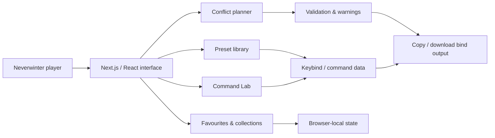
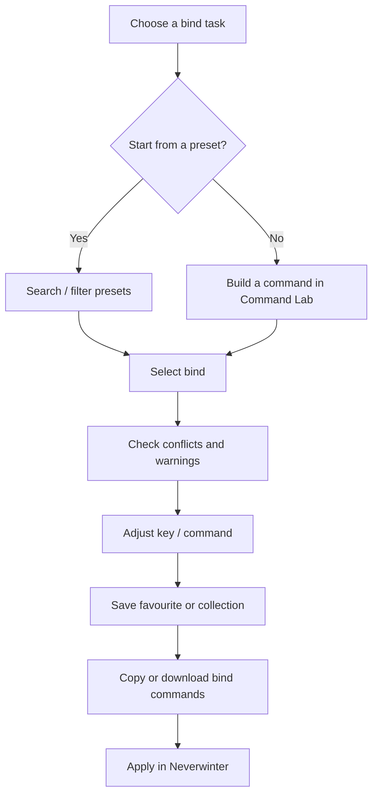
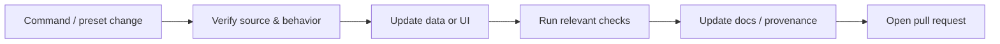

<div align="center">

# BindForge NW

**Build, review, organize, and export Neverwinter keybinds without memorizing console commands.**


[Open web app](https://neverwinterkeybind.netlify.app) · [Browse app](./web) · [Technical README](./web/README.md) · [Issues](https://github.com/Nischhalsubba/BindForge-NW/issues)

</div>

## Overview

**BindForge NW** is a Neverwinter keybind utility with a preset browser, conflict planner, command explorer, collection manager, and copy-ready `/bind` / `/unbind` generation. The maintained application lives in `web/` and uses a modern Next.js, React, and TypeScript front end.

| Audience | Use BindForge NW for |
|---|---|
| Players | Find practical binds, detect conflicts, organize presets and export commands |
| Developers | Maintain the data-driven UI, validation logic, sharing and deployment paths |
| Designers | Improve dense command workflows, states, hierarchy and responsive interaction |
| Maintainers | Review provenance, verification notes, command coverage and release quality |

<details open>
<summary><strong>🏗️ Interactive product architecture</strong></summary>


```mermaid
flowchart LR
    PLAYER["Neverwinter player"] --> UI["Next.js / React interface"]
    UI --> PRESETS["Preset library"]
    UI --> LAB["Command Lab"]
    UI --> PLANNER["Conflict planner"]
    UI --> COLLECTIONS["Favourites & collections"]
    PRESETS --> CATALOG["Keybind / command data"]
    LAB --> CATALOG
    PLANNER --> VALIDATE["Validation & warnings"]
    COLLECTIONS --> LOCAL["Browser-local state"]
    VALIDATE --> EXPORT["Copy / download bind output"]
    CATALOG --> EXPORT
```

</details>

## Player flow


```mermaid
flowchart TD
    START["Choose a bind task"] --> FIND{"Start from a preset?"}
    FIND -->|Yes| SEARCH["Search / filter presets"]
    FIND -->|No| BUILD["Build a command in Command Lab"]
    SEARCH --> SELECT["Select bind"]
    BUILD --> SELECT
    SELECT --> CHECK["Check conflicts and warnings"]
    CHECK --> EDIT["Adjust key / command"]
    EDIT --> SAVE["Save favourite or collection"]
    SAVE --> EXPORT["Copy or download bind commands"]
    EXPORT --> GAME["Apply in Neverwinter"]
```

## Repository map

- [`web/`](./web) — maintained web application and detailed documentation.
- [`bootstrap/`](./bootstrap) — repository bootstrap/support material.
- [`netlify.toml`](./netlify.toml) — Netlify integration.
- [`wrangler.jsonc`](./wrangler.jsonc) — Cloudflare-related configuration.
- [`.github/`](./.github) — automation and repository workflows.

## Getting started

```bash
git clone https://github.com/Nischhalsubba/BindForge-NW.git
cd BindForge-NW/web
```

Use the package manager and scripts declared in the application manifest. See [`web/README.md`](./web/README.md) for current setup, architecture, release status, and engineering notes.

## Design principles

Dense command tooling should stay scannable. Preserve clear grouping, readable key/command relationships, explicit conflict states, keyboard accessibility, useful empty states, responsive layouts, and copy/export feedback that tells the player what happened.

## SEO & discoverability

The public experience should naturally describe **Neverwinter keybinds, Neverwinter commands, bind presets, keybind conflicts, command generation, and Neverwinter utility tools** in titles, descriptions, headings, structured content, and useful visible copy. Avoid claims that are not supported by verified game behavior or provenance.

## Contribution flow


```mermaid
flowchart LR
    DATA["Command / preset change"] --> VERIFY["Verify source & behavior"]
    VERIFY --> IMPLEMENT["Update data or UI"]
    IMPLEMENT --> TEST["Run relevant checks"]
    TEST --> DOCS["Update docs / provenance"]
    DOCS --> PR["Open pull request"]
```
