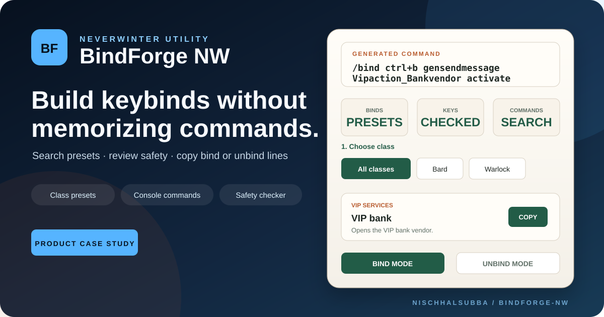

<div align="center">



# BindForge NW

### Build, review, organize, and export Neverwinter keybinds without memorizing console commands

A data-driven preset browser, conflict planner, command explorer, collection manager, and copy-ready `/bind` or `/unbind` generator.


[Live application](https://neverwinterkeybind.netlify.app) · [Engineering case study](./docs/PRODUCT_AND_ENGINEERING_CASE_STUDY.md) · [Architecture](./docs/architecture.md) · [Release status](./docs/RELEASE_STATUS.md)

</div>

## Product

BindForge NW helps Neverwinter players find, edit, validate, organize, share, and export practical keybind commands without searching scattered forum posts, wiki fragments, spreadsheets, or old chat messages.

The maintained application lives in this `web/` workspace. Repository-level files outside this directory exist only for GitHub and Cloudflare deployment integration.

## Main capabilities

| Capability | Description |
|---|---|
| Preset library | Searchable binds for combat, utility, class, companion, VIP, camera, social, and other actions |
| Conflict planner | Duplicate detection, native-key warnings, override guidance, and safer-key suggestions |
| Bulk bind packs | Select visible presets, copy bind/unbind packs, and download text files |
| Favourites and collections | Save favourites and named local collections in the browser |
| Shareable views | Copy URLs for selected presets, collections, and active filters |
| Provenance | Source type, confidence, verification date, game-version notes, and provenance filtering |
| Command Lab | Combine supported keys with catalog commands and optional arguments |
| Backup tools | Export, validate, import, migrate, and clear versioned local settings |
| Responsive UI | Mobile, tablet, and desktop layouts with keyboard, touch-target, and reduced-motion support |

## Command output

```text
/bind <key> <command> <optional arguments>
/unbind <key>
```

Example:

```text
/bind ctrl+b gensendmessage Vipaction_Bankvendor activate
```

## Run locally

Requirements:

- Node.js 22.13 or newer
- npm with the committed lockfile

From `web/`:

```bash
npm ci
npm run dev
```

Open `http://localhost:3000`.

## Verification

The normal engineering gate checks focused-test guards, ESLint, TypeScript, unit tests, catalog health, and the production Next.js build:

```bash
npm run check
```

The release gate adds browser typechecking and Playwright coverage across mobile, tablet, and desktop:

```bash
npx playwright install chromium
npm run check:release
```

## Repository layout

```text
repository/
├── .github/             GitHub workflows and repository policy
├── web/                 Maintained Next.js application
│   ├── app/             Product routes, components, state, and catalog UI
│   ├── docs/            Architecture, operations, and release documentation
│   ├── e2e/             Playwright browser regression tests
│   ├── public/          Public assets and crawler files
│   ├── scripts/         Catalog, release, and maintenance checks
│   └── tests/           Node contract and data tests
├── package.json         Cloudflare Workers Builds bootstrap
├── package-lock.json    Bootstrap lockfile
└── wrangler.jsonc       Cloudflare deployment entrypoint into web/.open-next
```

The root bootstrap files are deliberately small. Product dependencies, framework configuration, source code, tests, and documentation remain owned by `web/`.

## Production

- Canonical application: `https://neverwinterkeybind.netlify.app`
- Netlify remains the canonical public deployment documented by the project.
- Cloudflare Workers is maintained as an additional OpenNext-compatible deployment path.
- Offline/PWA installation is intentionally not part of the current release.

Current evidence, rollback criteria, and accepted limitations are recorded in [docs/RELEASE_STATUS.md](./docs/RELEASE_STATUS.md).

## Data maintenance

Before publishing command updates:

- verify behavior against the current Neverwinter version
- record a source URL when available
- record a verification date
- preserve aliases and required arguments
- clearly mark uncertain or undocumented behavior
- review default-key conflicts
- never describe advisory safety guidance as a guarantee

## Known limitations

- Neverwinter commands can change after patches.
- Some commands are undocumented or inconsistently supported.
- BindForge generates text but cannot apply binds inside the game.
- Players must paste generated commands themselves.
- Conflict guidance is advisory because personal in-game remaps are not readable by a browser.
- Favourites and collections remain browser-local unless exported or shared.

## Disclaimer

BindForge NW is an independent community project. It is not affiliated with or endorsed by Cryptic Studios, Arc Games, Gearbox Publishing, or the Neverwinter rights holders. Game names, commands, and related assets belong to their respective owners.

## Studio

Designed and developed by Archew.
